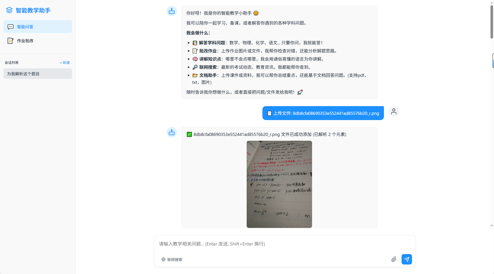
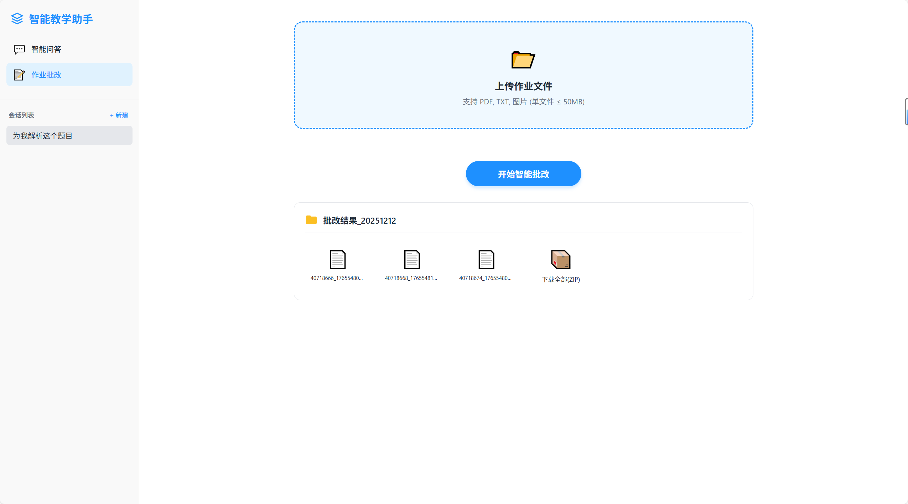
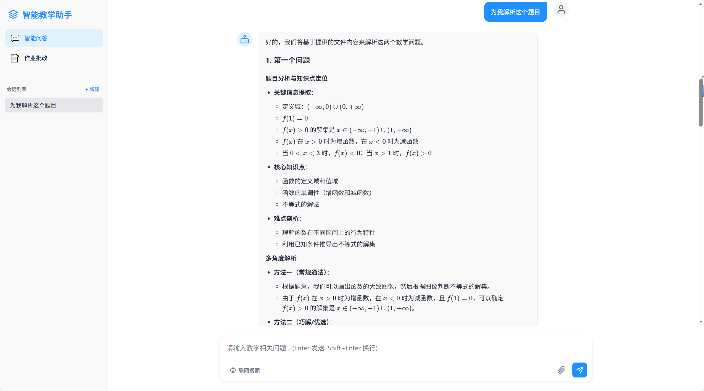

# 基于PaddleOCR-VL的多模态RAG智能教学助手系统

这是一个专为教师设计的智能化教学辅助系统，结合了 **PaddleOCR** 的多模态文档解析能力、**RAG (检索增强生成)** 技术以及 **大语言模型 (Qwen)** 的推理能力。系统旨在通过智能化的手段，协助教师完成作业批改、难题解析、备课辅助等繁琐工作，提升教学效率。

## 📖 项目简介

本项目构建了一个集成的智能教学助手，具备以下核心能力：
*   **多模态理解**：支持 PDF、图片 (JPG/PNG)、Word、PPT 等多种格式的教学资料上传与解析。
*   **智能问答 (RAG)**：基于上传的文档资料，进行精准的知识点检索与回答，支持多轮对话。
*   **批量作业批改**：自动化处理学生作业（图片/PDF），利用多模态大模型进行语义分析与评分，并生成详细的 PDF 批改报告。
*   **互联网增强**：集成 Tavily 搜索，实时获取最新的教育资讯与解题思路。

## 📸 项目展示

### 1. 上传并解析多模态文件

支持上传 PDF、图片等多种作业文件，系统会通过 PaddleOCR-VL 自动完成版面分析与文字/公式识别，为后续 RAG 检索和批改提供结构化数据。

### 2. 批量批改作业

教师可以一次性上传多份学生作业，后台异步批量处理，自动给出评分、知识点定位和改进建议，并生成可下载的批改结果文件夹。

### 3. 智能体问题讲解

基于作业内容和外部检索结果，智能体会以教学化的方式分步骤讲解题目，给出多种解法和举一反三的变式题，帮助老师和学生深入理解知识点。

---

## 🛠 技术栈

### 前端 (Frontend)
*   **框架**: Django 5.2.9 (Python Web Framework)
*   **UI**: HTML5, CSS3, JavaScript (原生 + 模板渲染)
*   **特性**: 响应式布局，实时流式响应 (Streaming Response)，文件拖拽上传。

### 后端 (Backend)
*   **API 服务**: FastAPI (高性能异步 Web 框架)
*   **大语言模型**: Aliyun Bailian (Qwen-Max / Qwen-VL)
*   **编排框架**: LangChain, LangGraph (构建有状态的智能体应用)
*   **多模态解析**: PaddlePaddle (PaddleOCR) - 支持复杂版面分析与文字识别
*   **向量数据库**: ChromaDB / Faiss (本地向量存储与检索)
*   **工具集成**: Tavily (网络搜索), MCP (Model Context Protocol)

---

## 🏗 项目架构

```mermaid
graph TD
    User[用户 (教师/学生)] --> Frontend[前端 (Django)]
    Frontend --> API[后端 API (FastAPI)]
    
    subgraph "Backend Core"
        API --> SessionMgr[会话管理]
        SessionMgr --> Agent[智能体 (LangGraph)]
        
        Agent --> LLM[大语言模型 (Qwen)]
        Agent --> Tools[工具集 (搜索/计算)]
        
        subgraph "RAG System"
            Agent --> Retriever[混合检索器]
            Retriever --> VectorDB[(向量数据库)]
            Retriever --> PaddleOCR[多模态解析器]
        end
        
        subgraph "Batch Processing"
            API --> GradingWF[批改工作流]
            GradingWF --> PaddleOCR
            GradingWF --> LLM
            GradingWF --> PDFGen[报告生成器]
        end
    end
    
    PaddleOCR --> Docs[文档/图片]
    PDFGen --> Reports[批改报告]
```

## 🤖 智能体工作流程

本系统的智能体设计基于 **LangGraph**，实现了具备记忆和工具调用能力的 **ReAct** 模式：

1.  **感知 (Perception)**: 接收用户输入（文本/文件）。如果是文件，自动调用 `PaddlePTFParser` 进行多模态解析（OCR + 版面分析）。
2.  **规划 (Planning)**: 智能体根据用户意图（如“批改这份作业”或“解释这个知识点”）选择调用 RAG 检索、网络搜索或直接推理。
3.  **行动 (Action)**: 
    *   **RAG**: 在向量库中检索相关的教材或过往题目。
    *   **Search**: 调用 Tavily API 搜索最新解题方法。
    *   **Grading**: 触发后台批改工作流，并行处理多个作业文件。
4.  **响应 (Response)**: 整合所有信息，生成结构化的教学反馈，并以流式输出至前端。

## ✨ 核心特性

1.  **高精度OCR**: 基于 PaddleOCR，精准识别手写公式、几何图形和复杂排版。
2.  **批量处理**: 后台异步任务队列支持同时批改数十份作业，不阻塞前台交互。
3.  **会话隔离**: 每个用户的会话数据独立存储，保障数据安全与隐私。
4.  **流式反馈**: 模拟真人打字效果，提供流畅的交互体验。
5.  **PDF 报告**: 自动生成包含原题截图、批注和分数的专业 PDF 报告，便于打印和存档。

## 🚀 快速开始

### 环境要求
*   Windows / Linux / macOS
*   Python 3.10+
*   Java (用于部分依赖)

### 1. 克隆项目
```bash
git clone <repository_url>
cd jiaoshi_ai
```

### 2. 配置 API Key
进入 `Backend` 目录后：

1.  复制 `.env.example` 为 `.env`：
    ```bash
    cd Backend
    copy .env.example .env  # Windows
    ```
2.  打开 `Backend/.env`，根据下列说明填写对应的 Key：
    *   `ALIYUNBAILIAN_API_KEY`: 阿里云百炼 API Key（用于大语言模型 Qwen）
    *   `TAVILY_API_KEY`: Tavily Search API Key（用于联网搜索）
    *   `PADDLEOCR_VL_TOKEN`: (可选) PaddleOCR 相关服务 Token（用于云端 OCR 能力）

3.  如果你使用 LangSmith 做链路追踪，可额外配置：
    *   `LANGSMITH_API_KEY`
    *   `LANGCHAIN_TRACING_V2=true`

4.  API Key 获取地址参考：
    *   阿里云百炼 (Aliyun Bailian): https://bailian.console.aliyun.com/?tab=demohouse#/api-key
    *   Tavily: https://app.tavily.com/home
    *   飞桨 PaddlePaddle（若使用相关云服务）: https://aistudio.baidu.com
    *   LangSmith（可选）: https://smith.langchain.com

### 3. 一键启动
Windows 用户直接运行根目录下的启动脚本：
```powershell
start-dev.bat
```
首次运行前，请务必先按照上一步完成 `Backend/.env` 的配置，保证脚本能够正确加载模型与各 API 服务。

脚本将自动：
1.  在 `Backend` 和 `Frontend` 目录下创建并激活 Python 虚拟环境。
2.  安装后端与前端依赖（根据各自的 `requirements.txt` / `package.json`）。
3.  启动 FastAPI 后端服务 (端口 8000)。
4.  启动 Django 前端服务 (端口 8001)。

### 4. 访问应用
打开浏览器访问：`http://127.0.0.1:8001`
